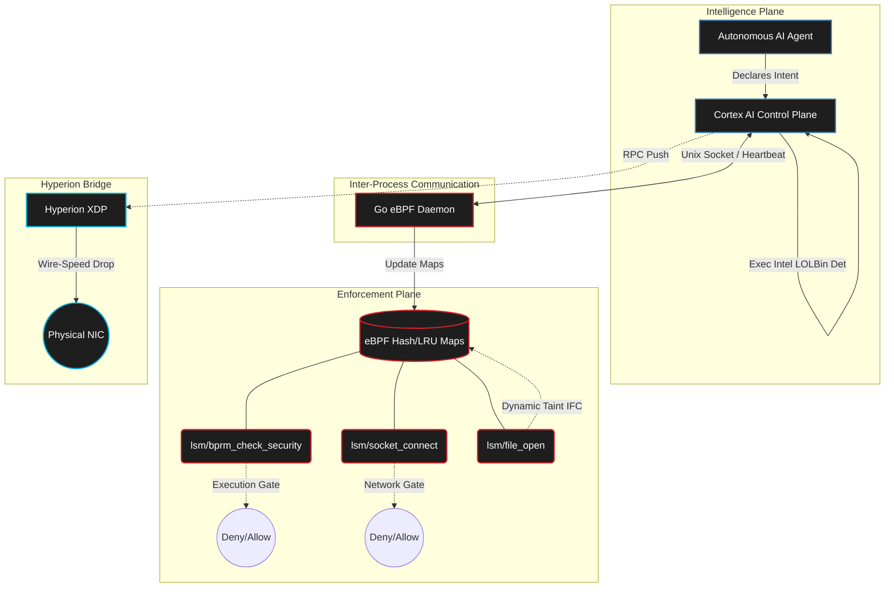

# Telos

### Intent-Based Runtime Security for Autonomous AI Agents

<p align="center">
  
  
  
  
  
</p>

Telos is a Linux kernel-level security runtime that enforces AI agent behavior through **Natural Language Intent Declarations**, **eBPF/LSM syscall gates**, and **real-time Information Flow Control**. Instead of writing static YAML rules, security policies are dynamically generated from what programs _say_ they intend to do.

---

## What is Telos? (The Simple Version)

Imagine your computer is a high-security building. Usually, if an employee (a program) has an ID badge, they can walk anywhere — into the vault, out the front door, or to the filing cabinets.

**Telos changes the rules.** When a program wants to do something, it must first declare its _intent_ in plain English:

> _"I need to download a weather report from weather.com"_

Telos uses an Intelligence Engine to instantly translate that intent into exact boundaries:

- **You can only use `curl`** (not `nc`, not `bash`, not `wget`)
- **You can only connect to `weather.com`** (nothing else)
- **If you touch passwords, all your network access is revoked instantly**

If the program suddenly tries to sneak into the vault (access a sensitive file like `/etc/shadow`), Telos sounds the alarm and permanently locks all the doors — meaning the program can't steal the data and run away. It protects your system by ensuring programs only do **exactly what they promised to do.**

> [!IMPORTANT]
> Telos operates at the **kernel level** using eBPF. This means no program can bypass it — not even root-level malware. The enforcement happens inside the Linux kernel itself, before any user-space code can interfere.

---

## How It Works (Technical Deep Dive)

Telos is powered by **eBPF** (Extended Berkeley Packet Filter), **Linux Security Modules (LSM)**, and an **AI inference engine (Cortex)**. It dynamically isolates and bounds the execution and network access of autonomous AI agents.

### Architecture



### The Dual-Gate Architecture

Telos implements two independent enforcement gates in the kernel:

**1. Execution Gate** (`lsm/bprm_check_security`)
- Intercepts every `execve()` syscall before a binary runs
- Checks the binary name against a per-intent allowlist stored in `exec_policy_map`
- Blocks Living-off-the-Land Binaries (LOLBins) like `nc`, `bash`, `wget` unless explicitly authorized
- Inherits policy from parent processes to prevent fork/exec bypass

**2. Network Gate** (`lsm/socket_connect`)
- Intercepts every outbound `connect()` syscall
- Verifies the destination IP against a dynamic allowlist populated by intent declarations
- Blocks IPv6 entirely for managed agents (prevents firewall bypass)
- Automatically expires network windows after intent TTL

> [!NOTE]
> Both gates operate at **O(1)** using eBPF hash maps. There is zero regex matching, zero string parsing, and zero copying in the hot path. Lookups are single hash table probes.

### Information Flow Control (The Capstone)

The most advanced feature of Telos is its **cross-vector taint tracking**:

1. Agent declares intent and gets authorized for `curl` + `cat` + `weather.com`
2. Agent reads `/etc/shadow` (a file mapped as `CRITICAL` in the inode map)
3. The `file_open` eBPF hook **dynamically elevates** the agent's taint level to `TAINT_CRITICAL`
4. The `socket_connect` hook detects the elevated taint and triggers a **Network Slam**
5. All outbound connections return `-EPERM` — the data **never leaves the machine**

> [!CAUTION]
> The Network Slam is irreversible for the lifetime of the process. Once taint is elevated to CRITICAL, the agent cannot make any network connections, even to previously authorized destinations. This is by design — if a process touched sensitive data, it must be assumed compromised.

### Domain Intelligence Engine

The DNS proxy on port `5353` runs a 5-layer classification pipeline:

| Layer | Function | Method |
|:------|:---------|:-------|
| L0 | Root domain extraction | Subdomain / combo-squat defense |
| L1 | Exact match | SQLite hash index lookup |
| L2 | Typosquat detection | Levenshtein distance + homoglyph normalization |
| L3 | Category mismatch | Intent-to-category validation |
| L4 | Reputation scoring | Trust level + risk flag aggregation |

A combined score determines the decision: **ALLOW** (< 30), **ESCALATE** (30-59), or **DENY** (>= 60).

> [!TIP]
> The LLM is **never** in the hot path. It is only called for ESCALATE decisions (estimated < 5% of queries). All ALLOW and DENY decisions are purely deterministic, O(1) lookups.

### Hyperion XDP Bridge

When the Domain Intelligence Engine denies a domain, Telos resolves the underlying IP addresses and pushes them to **Hyperion XDP** via an HTTP RPC call to `:9095/block`. Hyperion inserts these IPs into an eBPF `blacklist_map`, and the XDP hook drops matching packets at the **NIC driver level** — before the Linux network stack even allocates a socket buffer.

> [!WARNING]
> When attached to a physical NIC, Hyperion XDP drops are **irreversible** at the hardware level. Blacklisted IPs will experience 100% packet loss. Use with caution on production interfaces.

---

## Features

| Feature | Description |
|:--------|:-----------|
| Intent-Based Policy | Agents declare goals in natural language — policies are auto-generated |
| Dual-Gate Enforcement | Separate Execution Gate (`execve`) and Network Gate (`socket_connect`) |
| Dynamic IFC | Touching sensitive files elevates taint and triggers Network Slam |
| Domain Intelligence | O(1) SQLite-backed scoring with typosquat and homoglyph detection |
| LOLBin Defense | Blocks living-off-the-land binaries per-intent |
| Dynamic Drawbridge | Network windows auto-expire after intent TTL |
| DNS Interception | Transparent proxy with real-time domain classification |
| Mirage Deception | Honeypot files that trap and fingerprint attacker behavior |
| Fail-Open/Closed Watchdog | Bidirectional heartbeat between eBPF and Cortex planes |
| Prometheus Metrics | Enterprise-grade observability on `:9094/metrics` |
| Hyperion XDP Bridge | Malicious IPs pushed to XDP for wire-speed packet drops |
| Sentinel Heki | Hypervisor-Enforced Kernel Integrity for hardware-level BPF map protection |

---

## Getting Started

### Prerequisites

- Linux Kernel >= 5.15 (eBPF LSM support required)
- Go >= 1.21
- Python 3.10+
- clang / llvm (for eBPF compilation)
- bpftool (for BTF/vmlinux generation)

### Installation

```bash
git clone https://github.com/nevinshine/telos-runtime.git
cd telos-runtime

# Install Python dependencies
pip install -r cortex/requirements.txt

# (Optional) Download the LLM model for control-plane escalation
./scripts/download_model.sh
```

### Running Telos

```bash
export TELOS_CORTEX_AUTH_TOKEN="$(python3 - <<'PY'
import secrets
print(secrets.token_urlsafe(32))
PY
)"
sudo -E telos start    # Build and launch the full runtime
sudo telos status   # Check system health
sudo telos dash     # Launch the real-time Telemetry Dashboard
sudo telos stop     # Gracefully stop all components
telos help          # Display help
```

### Web Telemetry Dashboard

```bash
python3 web_dashboard.py
# Open http://127.0.0.1:8088

# Optional: require a local bearer token
TELOS_DASH_TOKEN=change-me python3 web_dashboard.py
# Open http://127.0.0.1:8088/?token=change-me

# Binding beyond localhost requires TELOS_DASH_TOKEN
TELOS_DASH_TOKEN=change-me python3 web_dashboard.py --host 0.0.0.0
```
The Cortex gRPC control plane binds to `127.0.0.1` by default and requires
clients to include `TELOS_CORTEX_AUTH_TOKEN` as a bearer token in gRPC metadata.
Only override the bind host for a remote deployment after adding a trusted
network boundary.

---

## Demonstrations

### Demo 1: Execution Gate (LOLBin Defense)

```bash
sudo -E telos start
export TELOS_CORTEX_AUTH_TOKEN="same-token-used-by-cortex"
python3 demo_payload.py
```

**What happens:**
1. Agent declares intent: _"I need to download a file from the server"_
2. `curl` executes successfully (it was authorized)
3. `nc` is **BLOCKED** — the Execution Gate denies it because it was never part of the declared intent
4. Agent declares malicious intent: _"I need to share credentials"_
5. `cat /etc/passwd` is **BLOCKED** — sensitive file access denied
6. `nc githuh.com 4444` is **BLOCKED** — both the binary and the typosquatted domain are denied

### Demo 2: Information Flow Control (Network Slam)

```bash
sudo -E telos start
export TELOS_CORTEX_AUTH_TOKEN="same-token-used-by-cortex"
sudo -E python3 demo_ifc.py
```

**What happens:**
1. Agent declares: _"I need to check security compliance"_
2. Agent reads `/etc/shadow` — eBPF elevates taint to `CRITICAL`
3. Agent tries `curl evil.com` — **Network Slam** kicks in, connection killed with `-EPERM`
4. Data never leaves the machine

### Demo 3: Hyperion XDP Bridge

```bash
# Terminal 1: Start Hyperion XDP
cd ~/code/hyperion-xdp && sudo ./bin/hyperion_ctrl -iface lo -telemetry

# Terminal 2: Start Telos
cd ~/code/telos-runtime && sudo -E telos start

# Terminal 3: Query a typosquatted domain
python3 -c "
from dnslib import DNSRecord
q = DNSRecord.question('githuh.com')
r = q.send('127.0.0.1', 5353, tcp=False, timeout=5)
print(DNSRecord.parse(r))
"
```

**Watch Terminal 1:** Hyperion prints `[TELOS-RPC] Added 97.107.140.81 to XDP Blacklist`

---

## Performance

Benchmarked under **10 Million operations** across **100 concurrent threads** on native Linux:

| Syscall Hook | Native Baseline | Telos Guarded | Overhead |
|:-------------|:---------------:|:-------------:|:--------:|
| `file_open` (IO) | 26.51 us | 28.79 us | +2.27 us (+8.5%) |
| `bprm_check_security` (Exec) | 6431 us | 6625 us | +193 us (+3.0%) |
| `socket_connect` (Network) | 195.57 us | 199.46 us | +3.89 us (+1.9%) |

> [!NOTE]
> Sub-microsecond map lookups. Zero-copy ringbuf telemetry. Production-grade overhead at enterprise scale.

---

## Project Structure

```
telos-runtime/
├── telos                      # CLI Orchestrator
├── cortex/                    # AI Intelligence Engine (Python)
│   ├── main.py                #   Cortex gRPC Server
│   ├── verifier.py            #   Dual-Gate Intent Verifier
│   ├── domain_intel.py        #   Domain Intelligence (L0-L4)
│   ├── exec_intel.py          #   Execution Intelligence (LOLBin)
│   ├── dns_proxy.py           #   DNS Interception Proxy
│   ├── guardian.py            #   Agent Registry and Taint Manager
│   ├── llm_verifier.py        #   LLM Escalation (Control Plane)
│   ├── mirage_manager.py      #   Deception Engine
│   └── policy.yaml            #   Security Policy Configuration
├── telos_core/                # eBPF Kernel Security Module (C + Go)
│   ├── src/bpf_lsm.c         #   LSM Hooks (exec, file, connect)
│   ├── loader/main.go         #   Go eBPF Loader + IPC + Prometheus
│   └── maps/                  #   Shared map definitions
├── shared/                    # gRPC Protocol Definitions
│   ├── protocol.proto         #   Protobuf schema
│   └── common_maps.h          #   Shared C struct definitions
├── browser_eye/               # Chrome Extension (Browser Taint)
├── deploy/                    # Docker + Systemd Configs
│   ├── telos-loader.service   #   Go Daemon systemd unit
│   ├── telos-cortex.service   #   Python Cortex systemd unit
│   └── vulnerable_agent/      #   Red team simulation scripts
├── benchmarks/                # Performance and Stress Tests
├── tests/                     # Verification Scripts
├── demo_payload.py            # Phase 5 Demo (Exec Gate)
├── demo_ifc.py                # Phase 7 Demo (IFC Network Slam)
└── Makefile                   # Build system
```

---

## Engineering Phases

<details>
<summary><b>Phase 1-3: Foundation</b> — Intent Networking and Browser Extension</summary>

- Established the Cortex AI gRPC server and eBPF socket map
- Built the Browser Eye Chrome extension for pre-OS URL taint detection
- Connected natural language intents to dynamic kernel drawbridges

</details>

<details>
<summary><b>Phase 4: DNS Interception and Domain Intelligence</b></summary>

- SQLite-backed domain scoring engine with 5 classification layers (L0-L4)
- Typosquat detection via Levenshtein distance and homoglyph normalization
- Transparent DNS proxy on port 5353 with upstream forwarding to 8.8.8.8
- Combo-squat defense via root domain extraction and embedded brand detection

</details>

<details>
<summary><b>Phase 5: Execution Boundary</b> — Syscall-Level LOLBin Defense</summary>

- `bprm_check_security` LSM hook intercepts every `execve()` call
- Per-intent execution allowlists stored in `exec_policy_map`
- Parent-inheritance tracking prevents fork/exec bypass
- Execution Intelligence Engine classifies binaries by risk category

</details>

<details>
<summary><b>Phase 6: Telemetry Dashboard</b></summary>

- Split-screen terminal UI displaying Cortex AI events and Kernel eBPF events
- Real-time tail of intent declarations, blocks, and taint mutations

</details>

<details>
<summary><b>Phase 7: Dynamic Data-Flow Tracking (IFC)</b> — The Capstone</summary>

- Cross-vector taint propagation: file access triggers network revocation
- `file_open` hook monitors inode sensitivity map
- Reading a CRITICAL file elevates taint to `TAINT_CRITICAL`
- `socket_connect` hook enforces Network Slam — drops all connections
- Prevents data exfiltration even when the agent has legal network access

</details>

<details>
<summary><b>Phase 8: CLI and Documentation Polish</b></summary>

- `telos` CLI orchestrator with `start`, `stop`, `status`, `dash`, `help`
- Comprehensive whitepaper documenting the architecture

</details>

<details>
<summary><b>Phase 9: Extreme Contention Benchmarking</b></summary>

- 10M-operation stress tests across 100 concurrent threads
- File open overhead: +2.27us (+8.5%)
- Exec gate overhead: +193us (+3.0%)
- Network gate overhead: +3.88us (+1.9%)

</details>

<details>
<summary><b>Phase 10: LRU State Management</b></summary>

- Migrated `process_map` and `network_map` to `BPF_MAP_TYPE_LRU_HASH`
- Kernel-level pressure valve: graceful eviction under memory pressure

</details>

<details>
<summary><b>Phase 11: Fail-Open / Fail-Closed Heartbeat</b></summary>

- Bidirectional watchdog between Go eBPF daemon and Python Cortex
- Fail-Open: Audit-only mode (preserves uptime)
- Fail-Closed: Full network flush (zero-trust lockdown)

</details>

<details>
<summary><b>Phase 12: Enterprise Observability</b></summary>

- Prometheus metrics endpoint on `:9094/metrics`
- Counters: `telos_exec_blocks_total`, `telos_network_blocks_total`, `telos_ifc_elevations_total`
- Gauge: `telos_active_drawbridges`
- Systemd service files for production deployment

</details>

<details>
<summary><b>Phase 13: Hyperion XDP Bridge</b></summary>

- Telos Domain Intelligence pushes malicious IPs to Hyperion XDP via HTTP RPC
- Hyperion `blacklist_map` drops packets at NIC level with `XDP_DROP`
- Wire-speed enforcement — packets killed before reaching the network stack

</details>

<details>
<summary><b>Phase 14: Sentinel Heki Integration (Ring -1)</b></summary>

- Established Hypervisor-Enforced Kernel Integrity (Heki) via a cross-layer IPC bridge (`/tmp/heki.sock`).
- `telos_core` dynamically leaks the Guest Virtual Addresses (GVA) of critical BPF maps to `sentinel-vmi` using `bpf_map_update_value` kprobes.
- The VMI hypervisor performs page-table walks using the guest's `CR3` to resolve physical addresses and locks the maps using hardware Extended Page Tables (EPT/NPT) write-protection.
- **Drawbridge Protocol**: Dynamic map updates are safely permitted via cryptographic `CPUID` signals (`KVM_EXIT_CPUID`) from `telos_daemon`, verified using a hypervisor-issued 32-bit `Nonce` and Thread `CR3`.
- **Mock IPC Testing Mode**: Fully simulates the Ring -1 pipeline (GPA translation bypass & mock nonces) for cloud VMs lacking bare-metal nested virtualization (`/dev/kvm`).
- **Performance**: Zero-bypass accuracy. Hardware VM-Exit intercepts and MTF single-stepping incur only ~4.5μs to 5μs overhead per policy mutation, completely invisible to the 100,000+ ops/sec throughput.

</details>

---

## Configuration

Edit `cortex/policy.yaml` to customize security boundaries:

```yaml
execution:
  default_mode: enforce          # enforce | audit
  safe_binaries:                 # Always allowed (system essentials)
    - cat
    - ls
    - curl

network:
  always_allowed:                # Pre-authorized destinations
    - api.weather.com
    - github.com

filesystem:
  sensitive_paths:               # Files that trigger taint elevation
    - /etc/shadow
    - /etc/passwd
    - ~/.ssh/id_*
```

---

## Development

```bash
make bpf          # Build eBPF objects only
make loader       # Build Go loader only
make all          # Full build (BPF + Loader)

cd tests && bash verify.sh           # Run verification suite
cd benchmarks && python3 lsm_bench.py  # Run performance benchmarks
```

---

## License

MIT License — see [LICENSE](LICENSE).

---

<p align="center">
  <b>Telos</b> — <em>Because intent should be the perimeter.</em>
</p>
